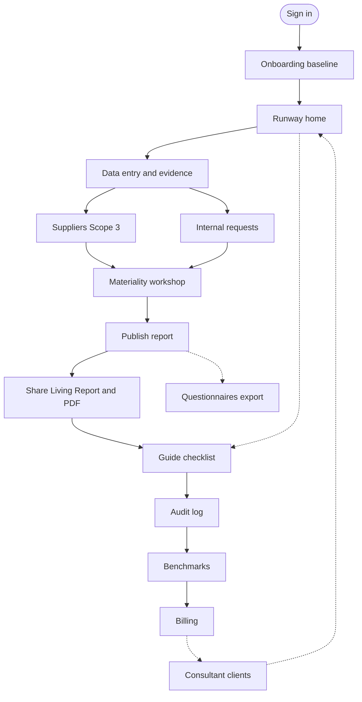
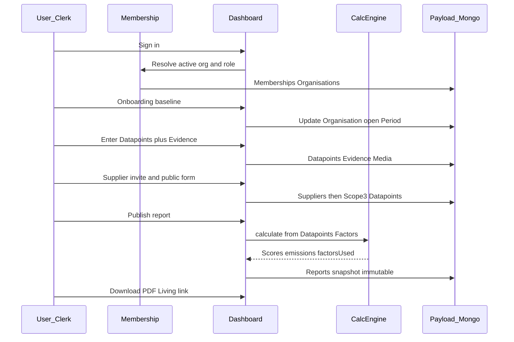
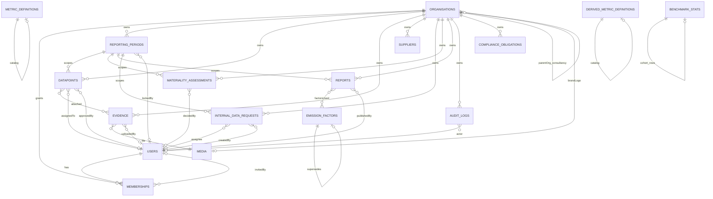
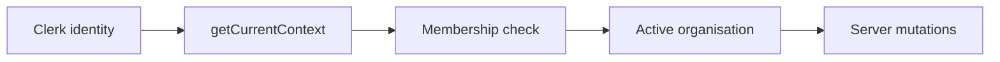

# ClearESG — Product Intent, User Flow & Data Model

This document explains **why ClearESG exists**, **who it is for**, and **what to do on each dashboard page** in the order a real organisation should work. It also describes complete journey cases and how Payload collections connect.

---

## 1. Intention of the project

**ClearESG** is an ESG **compliance** platform — not a “be greener” lifestyle app.

**Core thesis:** Demand is driven by **mandatory reporting law** (EU CSRD, India SEBI BRSR cascading through supply chains). Companies buy because a **deadline** exists, not because they want a dashboard.

**Positioning:** Enterprise ESG tools cost six figures and take months. ClearESG aims to get an SME **audit-ready this quarter**: enter data once, map to frameworks, collect Scope 3 from suppliers without accounts, lock a defensible evidence trail, and publish a **Living Report** + PDF banks/buyers can trust.

**What we deliberately sell**

| Capability          | Why it matters                                           |
| ------------------- | -------------------------------------------------------- |
| Compliance Runway   | Countdown + gaps, not a vanity dashboard                 |
| Data + evidence     | Every figure can be measured/estimated and tied to proof |
| Supplier chains     | Scope 3 without forcing suppliers to create accounts     |
| Double materiality  | CSRD-required workshop in-product                        |
| Versioned factors   | Auditors ask “which factor, which year?”                 |
| Living Report + PDF | Shareable artefact, not only a dead export               |
| Consultant centre   | Advisories run many SMEs in one place                    |

**Anti-goals (not this product):** heavy-industry carbon platforms, IoT live sensors, AI that invents regulation.

---

## 2. Targeted people

### Primary — SME (direct)

- **Size:** roughly 40–400 people
- **Trigger:** fell into CSRD scope, or a large customer sent a supplier questionnaire (BRSR cascade)
- **Buyer / user:** CFO, ops manager, or “someone who got handed ESG” — **no sustainability team**
- **Need:** be told exactly what to do next; finish before the filing / buyer deadline

### Primary — ESG consultant (multi-tenant)

- Boutique advisory with many SME clients
- Today: spreadsheets and email chase
- Need: one Command Centre, white-label portal/PDF, client health (RAG), reusable sector templates
- **Growth engine:** one consultant ≈ many SMEs

### Secondary readers of the output (not daily users)

- Banks / buyers reviewing a Living Report link or PDF
- Auditors / assurance reviewers checking evidence hashes and factor pins
- Internal teammates (contributors / viewers) filling assigned metrics

### Roles inside an organisation

| Role          | Typical access                                   |
| ------------- | ------------------------------------------------ |
| Owner / Admin | Billing, publish, approve, invite, lock periods  |
| Contributor   | Enter data, upload evidence, respond to requests |
| Viewer        | Read-only runway, reports, audit log             |

Auth model: **Clerk = identity. Payload Membership = authorisation.** Login alone does not grant org access.

---

## 3. Recommended user flow (order of work)

Work left-to-right through **setup → collect → collaborate → publish → assure**. Return to Runway whenever you need the next action.

### Phase A — Get in and set the org

1. **Sign up / sign in** (Clerk).
2. **Membership** resolves; pick or create an organisation.
3. **`/dashboard/onboarding`** — 60-second baseline (sector, country, size, etc.).
4. System creates / opens a **reporting period** (`status: open`).
5. Land on **`/dashboard` (Runway)**.

### Phase B — Close the biggest gaps

6. **Runway** — read days-to-filing, readiness, next three actions.
7. **Data** — enter required metrics; set quality; attach evidence; assign owners.
8. **Suppliers** — add contacts, send one-link forms, chase responses → Scope 3.
9. **Requests** — assign metric packs to teammates with due dates.
10. **Materiality** — score topics; finalise when ready (locks the workshop).

### Phase C — Publish and share

11. **Reports** — publish immutable version; download PDF / JSON / CSV; open Living Report.
12. **Questionnaires** — generate mapped buyer/EcoVadis-style exports when needed.
13. **Guide** — confirm first-report checklist (auto-ticks from real progress).

### Phase D — Defend and improve

14. **Audit** — review who changed what.
15. **Benchmarks** — sector position when cohort `n ≥ 8`.
16. **Billing** — plan limits / upgrade.
17. **Consultant → Clients** (consultancy orgs only) — invite and monitor clients.

---

## 4. Dashboard pages (user-flow order)

### 4.1 Onboarding — `/dashboard/onboarding`

**Purpose:** Turn a blank org into a usable baseline in under a minute.

**Do this when:** First login, or org has no `onboardedAt`.

**What you do**

- Answer sector, country, headcount / revenue band, sites, etc.
- Receive an **estimated** footprint/score (clearly marked estimated).
- Finish → redirect to Runway; Baseline drops out of nav when onboarded.

**Done when:** Organisation is onboarded; an open reporting period exists (or is created on first write).

---

### 4.2 Runway — `/dashboard`

**Purpose:** Compliance home — countdown and “what next,” not a chart zoo.

**Do this when:** Every session start; after publishing; when stuck.

**What you see / do**

- Days to filing (from compliance obligation).
- Readiness (% of required metrics present).
- Calm status (on track / at risk / critical) aligned with gaps.
- Overall gauge + Scope 1/2/3 stack.
- Next three gaps with plain-language “need.”
- Link into Data / Reports / Guide / Audit.

**Done when:** You know the single next action and click it.

---

### 4.3 Data — `/dashboard/data`

**Purpose:** Interactive collection spine. Spreadsheet import is an on-ramp only.

**Do this when:** Runway says enter/confirm metrics; after onboarding.

**What you do**

- Enter values for E/S/G metrics (or Yes/No policies).
- Set quality: Measured / Calculated / Estimated / Missing.
- Attach evidence (file drop / upload) — rows without evidence stay flagged.
- Assign owner to a teammate when invites exist.
- Optional: spreadsheet template download → dry-run diff → commit.
- Optional: duplicate prior period structure into the open period.

**Rules**

- Period must be **open**; locked/published periods refuse writes.
- Approval may reset to pending when values change.
- Derived metrics are calculated — not typed by hand.

**Done when:** Required runway metrics are present (non-missing) and critical rows have evidence where you claim “measured.”

---

### 4.4 Suppliers — `/dashboard/suppliers`

**Purpose:** Scope 3 collection without supplier accounts.

**Do this when:** Spend / purchased goods / travel / waste matter for your footprint or buyer asks for supply-chain data.

**What you do**

- Add supplier (name, email, category, annual spend).
- Send / copy tokenised public form link (`/s/[token]`).
- Track status and response rate; send day-7/14 reminders.
- Submitted forms reaggregate into Scope 3 datapoints.

**Done when:** Priority spend is listed and at least one response is in (or chase is underway).

---

### 4.5 Requests — `/dashboard/requests`

**Purpose:** Intra-org collaboration — assign metric checklists to teammates who sign in.

**Do this when:** One person cannot own all metrics (energy vs HR vs finance).

**What you do**

- Create request: title, assignee, metric keys, due date.
- Teammate works in Data; you update request status (not sent → sent → opened → submitted).

**Not for:** External suppliers (use Suppliers).

**Done when:** Open requests are assigned and progressing before the filing date.

---

### 4.6 Materiality — `/dashboard/materiality`

**Purpose:** Double materiality workshop (impact × financial) for ESRS topics.

**Do this when:** Preparing CSRD-style disclosure; before locking the story in the published report.

**What you do**

- Score topics; position on matrix.
- Generate / edit narrative.
- **Finalise** when leadership agrees — assessment locks.

**Done when:** Material topics are decided, narrative is coherent, assessment is final (if you are publishing against CSRD expectations).

---

### 4.7 Reports — `/dashboard/reports`

**Purpose:** Immutable publish + artefacts for banks/buyers/auditors.

**Do this when:** Period data is good enough to share (and launch gates allow publish in production).

**What you do**

- Publish a versioned snapshot (never overwrite).
- Download **PDF** (flagship print), JSON, CSV.
- Open **Living Report** share link (`/r/[token]`).
- Optionally add narrative / FAQ for share pack.

**Done when:** A version exists, PDF looks right, Living Report link works for an external reader.

---

### 4.8 Questionnaires — `/dashboard/questionnaires`

**Purpose:** Deterministic mapping from canonical datapoints → buyer/questionnaire-style export.

**Do this when:** A customer sends EcoVadis-lite / similar packs and you refuse to re-key Excel.

**What you do**

- Generate mapped export from current period data.
- Review coverage; fill gaps in Data; regenerate.

**Done when:** Export covers the fields the buyer asked for, or gaps are explicit.

---

### 4.9 Guide — `/dashboard/guide`

**Purpose:** First-report checklist shared on the organisation (not localStorage).

**Do this when:** New team; first publish; onboarding hangover.

**Steps (typical)**

1. Confirm sector and country
2. Finish organisation baseline
3. Enter top three figures
4. Request one supplier
5. Publish a living report

Progress is **derived** from real org state and can be ticked manually.

**Done when:** Checklist complete or Guide is no longer the team’s focus.

---

### 4.10 Audit — `/dashboard/audit`

**Purpose:** Governance change log (who published, assigned, approved, invited…).

**Do this when:** Preparing for assurance; investigating a surprise score change.

**What you do**

- Filter by entity type.
- Read humanised actions and relative times.
- Export full account log if needed.

**Done when:** Sensitive actions are attributable for the period you are defending.

---

### 4.11 Benchmarks — `/dashboard/benchmarks`

**Purpose:** Anonymised sector cohort percentiles (network effect).

**Do this when:** You have published enough comparable data and cohort size ≥ 8.

**What you do**

- View position vs peers when available.
- If empty: collect/publish more; wait for cohort; respect opt-out privacy.

**Done when:** You can explain intensity vs peers to leadership (or you know why cohort is empty).

---

### 4.12 Billing — `/dashboard/billing`

**Purpose:** Plan, usage caps, upgrade / manage subscription.

**Do this when:** Hitting period limits, watermarked PDF, or need consultant seats/clients.

**Notes:** Free may watermark PDF and limit periods; Pro unlocks clean PDF and higher limits. Paid checkout is gated until Workstream 0 decisions are signed off in production.

---

### 4.13 Consultant — Clients — `/dashboard/consultant`

**Purpose:** Multi-client health board (consultancy orgs only).

**Do this when:** You advise multiple SMEs.

**What you do**

- Invite pre-branded clients.
- See RAG health (deadlines, gaps).
- White-label brand/domain settings.
- Switch into a client org and run the same company flow.

**Done when:** Each client has an open period and a clear next action on their Runway.

---

## 5. After the org is created — what should they do?

### First week (activation)

1. Finish **Onboarding**.
2. Open **Runway** — note filing date or add a compliance obligation.
3. On **Data**, replace the worst **estimated/missing** metrics (start with electricity, fuels, headcount).
4. Attach at least one **evidence** file to a measured row.
5. Add **one supplier** and send the link.
6. Tick progress on **Guide**.

### Before first external share

1. Resolve Runway “next three.”
2. Finish or explicitly accept open **Requests**.
3. **Materiality** final if CSRD narrative is required.
4. **Publish** Reports v1.
5. Download PDF; open Living Report in an incognito window.
6. Skim **Audit** for unexpected writes.

### Ongoing (each period)

1. Open or duplicate period structure.
2. Collect → approve → publish new version.
3. Chase suppliers / teammates.
4. Recompute benchmarks when prompted.
5. Review Billing before year-end renewals.

---

## 6. Complete cases (happy path and edges)

### Case A — First-time SME, no consultant

Sign in → Onboarding → Runway → Data (core E metrics) → one Supplier → Guide → Publish → PDF + Living Report → Audit skim.

### Case B — Buyer questionnaire under time pressure

Onboarding (if needed) → Data (only mapped fields) → Questionnaires generate → fill gaps in Data → regenerate → optional Publish for a durable snapshot.

### Case C — Scope 3 heavy company

Data (spend totals) → Suppliers list by spend → send links → chase → verify Scope 3 on Runway/PDF → Publish.

### Case D — Team split across departments

Owner invites members → Requests assign packs → Contributors fill Data → Admin approves → Publish.

### Case E — CSRD double materiality

Data baseline → Materiality workshop → Final lock → Publish with narrative → PDF materiality section.

### Case F — Consultant onboarding a book of clients

Consultancy org → Billing/Consultant plan → Clients invite → switch org → each client Case A → Command Centre monitors RAG.

### Case G — Period locked / read-only Data

Period `locked` or `published` → Data shows read-only → open or create a new open period (Reports / Materiality / ensureOpenPeriod paths) → continue writes.

### Case H — Viewer role

Can browse Runway/Reports; cannot write datapoints, publish, or update Guide.

### Case I — Free plan watermark

Publish still works; PDF shows Free watermark until upgraded (Pro = unmarked PDF per plan rules).

### Case J — Benchmark empty

Sector cohort `n < 8` → empty state explains peers needed; keep publishing electricity/intensity inputs; do not invent percentiles.

### Case K — Assurance pushback

Auditor asks for proof → Data evidence hashes → Living Report trail → Audit log → Factor registry on PDF appendix.

---

## 7. End-to-end journey diagram (roles)

---

## 8. Database schema — collections and connections

Storage: **MongoDB** via Payload CMS 3. Identity users may also sync with Clerk; **authorisation** is Membership.

### Collection map (relationships)

### Collection roles (short)

| Collection                   | Role                                                |
| ---------------------------- | --------------------------------------------------- |
| `users`                      | Payload users (linked to identity)                  |
| `media`                      | Uploaded files                                      |
| `organisations`              | Tenant; plan, brand, guide progress, opt-outs       |
| `memberships`                | User ↔ org + role + invite status                   |
| `reporting-periods`          | Open / locked / published windows                   |
| `metric-definitions`         | Canonical metric catalog                            |
| `derived-metric-definitions` | Derived metrics + framework mappings                |
| `emission-factors`           | Versioned factors (source, year, region)            |
| `datapoints`                 | Org+period values, quality, approval, evidence refs |
| `evidence`                   | File + hash + links to datapoints                   |
| `suppliers`                  | Supplier contacts, tokens, spend, status            |
| `internal-data-requests`     | Teammate metric packs                               |
| `materiality-assessments`    | Topic scores + narrative + lock                     |
| `reports`                    | Immutable snapshots + share tokens                  |
| `audit-logs`                 | Append-only governance events                       |
| `benchmark-stats`            | Anonymised cohort aggregates                        |
| `compliance-obligations`     | Filing deadlines driving Runway                     |

### Auth boundary (remember)

Never trust UI-only gates or the active-org cookie without Membership revalidation.

---

## 9. Related docs

- [`BUILD_PLAN.md`](../BUILD_PLAN.md) — binding product and engineering plan
- [`docs/PILOT_CHECKLIST.md`](PILOT_CHECKLIST.md) — pilot satisfaction checklist
- [`docs/LAUNCH_DECISIONS.md`](LAUNCH_DECISIONS.md) — open commercial/legal gates
- [`docs/AI_DEFERRED.md`](AI_DEFERRED.md) — AI scope deferred from v1

---

_Last aligned with dashboard routes under `/dashboard` and Payload collections registered in `src/payload.config.ts`._
